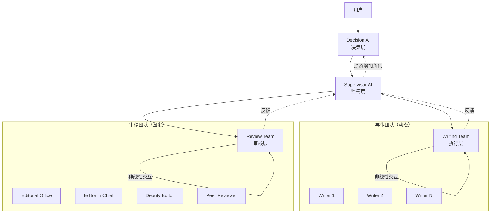
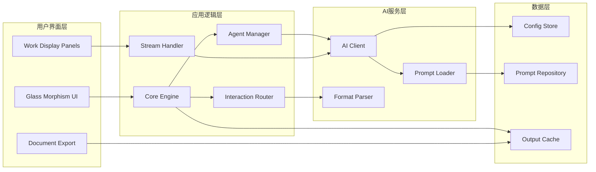
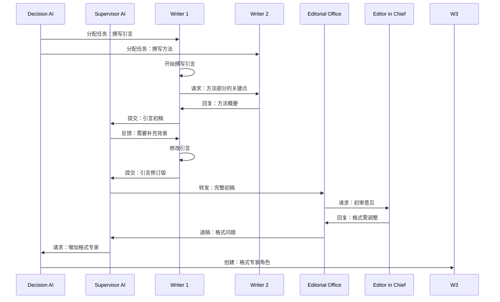

# 设计文档

## 概述

Agent Swarm写作系统是一个基于多智能体协作的学术论文创作和审稿平台。系统采用非线性交互模式，允许AI之间进行动态讨论、反馈和协商，并支持根据工作负载动态增加团队成员。

### 核心设计目标

1. **多智能体协作**: 实现决策AI、监管AI、写作团队和审稿团队的协同工作
2. **非线性交互**: 支持AI之间的双向沟通、讨论和协商，而非简单的线性流程
3. **动态扩展**: 根据工作量和质量问题自动增加AI角色
4. **实时可见性**: 通过流式输出和工作面板实时展示所有AI的工作过程
5. **灵活配置**: 支持自定义AI服务、提示词管理和输出格式
6. **现代化体验**: 采用苹果液态玻璃风格的独立桌面应用

### 技术栈选择

基于需求11（独立程序编译）和需求10（液态玻璃UI），推荐以下技术栈：

- **前端框架**: Tauri + React/Vue
  - Tauri提供轻量级的桌面应用框架，支持跨平台编译
  - 原生支持现代Web技术实现Glass Morphism效果
  - 无需浏览器或本地服务器即可运行
  
- **UI库**: 自定义CSS + Framer Motion
  - 完全控制Glass Morphism视觉效果
  - 支持流畅的动画和过渡效果
  
- **状态管理**: Zustand或Jotai
  - 轻量级状态管理，适合实时更新场景
  
- **AI集成**: 统一的HTTP客户端
  - 支持多种AI服务提供商（OpenAI、Anthropic、本地模型等）
  - 支持流式响应（SSE/WebSocket）
  
- **文档处理**: 
  - docx: docx.js
  - markdown: unified + remark
  - pdf: jsPDF或Puppeteer
  
- **数据持久化**: 
  - 配置存储: JSON文件 + 加密库（crypto-js）
  - 提示词管理: 文件系统读取

## 架构

### Agent Swarm架构模式

基于需求1的研究，系统采用**分层协作架构**（Hierarchical Collaborative Architecture）：



### 架构层次说明

1. **决策层（Decision Layer）**
   - 单一Decision AI负责任务分析、团队组建和动态扩展
   - 接收用户输入和Supervisor AI的扩展请求
   - 输出任务分配指令和角色配置

2. **监管层（Supervision Layer）**
   - 单一Supervisor AI负责质量检查和流程监控
   - 验证输出格式、记录返工次数、触发退稿机制
   - 检测人手不足并请求Decision AI增加角色

3. **执行层（Execution Layer）**
   - 动态数量的Writing Team成员
   - 支持成员之间的非线性交互（讨论、协商、反馈）
   - 每个成员有独立的工作面板和流式输出

4. **审核层（Review Layer）**
   - 固定结构的Review Team（编辑部、主编、副主编、审稿专家）
   - 支持成员之间的非线性交互
   - 执行标准学术审稿流程

### 系统架构图



### 非线性交互流程

系统支持AI之间的动态交互，而非传统的线性流程：



## 组件和接口

### 核心组件

#### 1. Core Engine（核心引擎）

负责系统的整体协调和流程控制。

```typescript
interface CoreEngine {
  // 初始化系统
  initialize(): Promise<void>;
  
  // 启动写作流程
  startWritingProcess(topic: string): Promise<void>;
  
  // 处理动态角色增加
  handleDynamicRoleAddition(reason: string, roleType: string): Promise<void>;
  
  // 触发退稿机制
  triggerRejectionMechanism(rejectionCount: number): Promise<void>;
  
  // 获取系统状态
  getSystemState(): SystemState;
}

interface SystemState {
  currentPhase: 'idle' | 'writing' | 'reviewing' | 'revising' | 'completed';
  activeAgents: AgentInfo[];
  rejectionCount: number;
  estimatedCompletion: Date;
}
```

#### 2. Agent Manager（智能体管理器）

管理所有AI角色的生命周期和配置。

```typescript
interface AgentManager {
  // 创建AI角色
  createAgent(config: AgentConfig): Promise<Agent>;
  
  // 销毁AI角色
  destroyAgent(agentId: string): Promise<void>;
  
  // 获取所有活跃角色
  getActiveAgents(): Agent[];
  
  // 动态增加角色
  addDynamicAgent(roleType: string, task: string): Promise<Agent>;
}

interface AgentConfig {
  id: string;
  name: string;
  role: AgentRole;
  promptTemplate: string;
  aiService: AIServiceConfig;
  capabilities: AgentCapabilities;
}

type AgentRole = 
  | 'decision' 
  | 'supervisor' 
  | 'writer' 
  | 'editorial_office' 
  | 'editor_in_chief' 
  | 'deputy_editor' 
  | 'peer_reviewer';

interface AgentCapabilities {
  canInternetAccess: boolean;
  canStreamOutput: boolean;
  canInteractWithPeers: boolean;
}
```

#### 3. Interaction Router（交互路由器）

处理AI之间的非线性交互和消息传递。

```typescript
interface InteractionRouter {
  // 发送消息
  sendMessage(message: AgentMessage): Promise<void>;
  
  // 订阅消息
  subscribeToMessages(agentId: string, callback: MessageCallback): void;
  
  // 广播消息到团队
  broadcastToTeam(teamType: 'writing' | 'review', message: AgentMessage): Promise<void>;
  
  // 请求反馈
  requestFeedback(fromAgent: string, toAgent: string, content: string): Promise<string>;
}

interface AgentMessage {
  id: string;
  type: MessageType;
  sender: string;
  receiver: string | string[]; // 支持单播和多播
  content: string;
  metadata: MessageMetadata;
  timestamp: Date;
}

type MessageType = 
  | 'task_assignment' 
  | 'work_submission' 
  | 'feedback_request' 
  | 'feedback_response' 
  | 'discussion' 
  | 'revision_request' 
  | 'approval' 
  | 'rejection';

interface MessageMetadata {
  priority: 'low' | 'medium' | 'high';
  requiresResponse: boolean;
  relatedTaskId?: string;
  attachments?: string[];
}
```

#### 4. Stream Handler（流式处理器）

处理AI的流式输出和实时显示。

```typescript
interface StreamHandler {
  // 开始流式输出
  startStream(agentId: string): StreamSession;
  
  // 处理流式数据块
  handleStreamChunk(sessionId: string, chunk: string): void;
  
  // 结束流式输出
  endStream(sessionId: string): void;
  
  // 订阅流式输出
  subscribeToStream(sessionId: string, callback: StreamCallback): void;
}

interface StreamSession {
  id: string;
  agentId: string;
  startTime: Date;
  buffer: string;
  isActive: boolean;
}

type StreamCallback = (chunk: string, isComplete: boolean) => void;
```

#### 5. AI Client（AI客户端）

统一的AI服务接口，支持多种AI提供商。

```typescript
interface AIClient {
  // 发送请求（支持流式）
  sendRequest(request: AIRequest): Promise<AIResponse | AsyncIterable<string>>;
  
  // 验证连接
  validateConnection(config: AIServiceConfig): Promise<boolean>;
  
  // 执行网络搜索
  performWebSearch(query: string): Promise<SearchResult[]>;
}

interface AIRequest {
  prompt: string;
  systemPrompt?: string;
  temperature?: number;
  maxTokens?: number;
  stream?: boolean;
  tools?: AITool[];
}

interface AIResponse {
  content: string;
  usage: TokenUsage;
  finishReason: string;
}

interface AIServiceConfig {
  name: string;
  apiKey: string;
  apiUrl: string;
  model: string;
  provider: 'openai' | 'anthropic' | 'custom';
}

interface AITool {
  type: 'web_search' | 'code_execution';
  enabled: boolean;
}
```

#### 6. Prompt Loader（提示词加载器）

从文件系统加载和管理提示词。

```typescript
interface PromptLoader {
  // 加载提示词
  loadPrompt(role: AgentRole, variables?: Record<string, string>): Promise<string>;
  
  // 重新加载所有提示词
  reloadPrompts(): Promise<void>;
  
  // 验证提示词完整性
  validatePrompt(promptPath: string): Promise<ValidationResult>;
  
  // 获取提示词版本
  getPromptVersion(role: AgentRole): string;
}

interface ValidationResult {
  isValid: boolean;
  errors: string[];
  warnings: string[];
}
```

#### 7. Format Parser（格式解析器）

解析和验证AI输出格式。

```typescript
interface FormatParser {
  // 解析AI输出
  parse(output: string): ParsedMessage | ParseError;
  
  // 格式化消息对象
  format(message: AgentMessage): string;
  
  // 验证格式
  validate(output: string): ValidationResult;
}

interface ParsedMessage {
  type: MessageType;
  sender: string;
  receiver: string | string[];
  content: string;
  metadata: MessageMetadata;
}

interface ParseError {
  error: string;
  line?: number;
  column?: number;
  suggestion?: string;
}
```

#### 8. Document Exporter（文档导出器）

导出最终文档为多种格式。

```typescript
interface DocumentExporter {
  // 导出为DOCX
  exportToDocx(content: DocumentContent): Promise<Blob>;
  
  // 导出为Markdown
  exportToMarkdown(content: DocumentContent): Promise<string>;
  
  // 导出为PDF
  exportToPdf(content: DocumentContent): Promise<Blob>;
}

interface DocumentContent {
  title: string;
  authors: string[];
  abstract: string;
  sections: DocumentSection[];
  reviewComments: ReviewComment[];
  revisionHistory: RevisionRecord[];
}

interface DocumentSection {
  heading: string;
  level: number;
  content: string;
  subsections?: DocumentSection[];
}

interface ReviewComment {
  reviewer: string;
  section: string;
  comment: string;
  severity: 'minor' | 'major' | 'critical';
  timestamp: Date;
}

interface RevisionRecord {
  version: number;
  date: Date;
  changes: string[];
  author: string;
}
```

### UI组件

#### 1. Glass Morphism Container

实现苹果液态玻璃效果的容器组件。

```typescript
interface GlassMorphismProps {
  blur?: number; // 模糊程度 (默认: 10px)
  opacity?: number; // 透明度 (默认: 0.7)
  theme?: 'light' | 'dark';
  children: React.ReactNode;
}

// CSS实现示例
const glassStyle = {
  background: 'rgba(255, 255, 255, 0.1)',
  backdropFilter: 'blur(10px)',
  border: '1px solid rgba(255, 255, 255, 0.2)',
  borderRadius: '16px',
  boxShadow: '0 8px 32px 0 rgba(31, 38, 135, 0.37)',
};
```

#### 2. Work Display Panel

显示单个AI工作状态的面板。

```typescript
interface WorkDisplayPanelProps {
  agent: AgentInfo;
  streamContent: string;
  status: AgentStatus;
  interactions: AgentMessage[];
  onInteractionRequest: (targetAgent: string, message: string) => void;
}

interface AgentInfo {
  id: string;
  name: string;
  role: AgentRole;
  avatar?: string;
  currentTask?: string;
}

type AgentStatus = 
  | 'idle' 
  | 'thinking' 
  | 'writing' 
  | 'waiting_feedback' 
  | 'revising' 
  | 'completed';
```

#### 3. Interaction Timeline

显示AI之间交互历史的时间线组件。

```typescript
interface InteractionTimelineProps {
  messages: AgentMessage[];
  highlightAgent?: string;
  onMessageClick: (message: AgentMessage) => void;
}
```

#### 4. Dynamic Team Visualizer

可视化显示团队结构和动态变化。

```typescript
interface DynamicTeamVisualizerProps {
  writingTeam: AgentInfo[];
  reviewTeam: AgentInfo[];
  onAgentSelect: (agentId: string) => void;
  showConnections: boolean; // 显示AI之间的交互连接
}
```

## 数据模型

### 配置数据模型

```typescript
// AI服务配置
interface AIServiceConfig {
  name: string;
  apiKey: string; // 加密存储
  apiUrl: string;
  model: string;
  provider: 'openai' | 'anthropic' | 'custom';
  maxTokens?: number;
  temperature?: number;
}

// 系统配置
interface SystemConfig {
  aiServices: AIServiceConfig[];
  defaultService: string;
  promptRepositoryPath: string;
  outputDirectory: string;
  theme: 'light' | 'dark' | 'auto';
  internetAccess: {
    enabled: boolean;
    allowedDomains?: string[];
  };
  streamingConfig: {
    chunkSize: number;
    updateInterval: number; // ms
  };
}
```

### 运行时数据模型

```typescript
// Agent实例
interface Agent {
  id: string;
  config: AgentConfig;
  state: AgentState;
  workHistory: WorkRecord[];
  interactionHistory: AgentMessage[];
}

interface AgentState {
  status: AgentStatus;
  currentTask?: Task;
  revisionCount: number;
  lastActivity: Date;
}

interface Task {
  id: string;
  description: string;
  assignedBy: string;
  deadline?: Date;
  priority: 'low' | 'medium' | 'high';
  dependencies?: string[]; // 依赖的其他任务ID
}

interface WorkRecord {
  taskId: string;
  startTime: Date;
  endTime?: Date;
  output: string;
  status: 'in_progress' | 'completed' | 'rejected' | 'revised';
  feedbackReceived: string[];
}

// 写作流程状态
interface WritingProcessState {
  topic: string;
  startTime: Date;
  currentPhase: ProcessPhase;
  writingTeam: Agent[];
  reviewTeam: Agent[];
  document: DocumentDraft;
  rejectionCount: number;
  revisionHistory: RevisionRecord[];
}

type ProcessPhase = 
  | 'initialization' 
  | 'task_allocation' 
  | 'writing' 
  | 'internal_review' 
  | 'peer_review' 
  | 'revision' 
  | 'final_review' 
  | 'completed' 
  | 'rejected';

interface DocumentDraft {
  version: number;
  sections: Map<string, string>; // section name -> content
  metadata: DocumentMetadata;
  lastModified: Date;
}

interface DocumentMetadata {
  title: string;
  authors: string[];
  abstract?: string;
  keywords: string[];
  wordCount: number;
}

// 退稿机制数据
interface RejectionAnalysis {
  rejectionCount: number;
  reasons: RejectionReason[];
  bottlenecks: Bottleneck[];
  suggestedActions: Action[];
}

interface RejectionReason {
  category: 'format' | 'quality' | 'completeness' | 'coherence';
  description: string;
  affectedSections: string[];
  severity: 'minor' | 'major' | 'critical';
}

interface Bottleneck {
  type: 'insufficient_personnel' | 'skill_gap' | 'communication_breakdown';
  description: string;
  affectedAgents: string[];
  suggestedRoleType?: string;
}

interface Action {
  type: 'add_agent' | 'reassign_task' | 'modify_prompt' | 'adjust_workflow';
  description: string;
  priority: number;
}
```

### 输出格式规范

AI输出必须遵循以下JSON格式：

```typescript
interface OutputFormat {
  messageType: MessageType;
  sender: string;
  receiver: string | string[];
  content: {
    text: string;
    attachments?: Attachment[];
  };
  metadata: {
    timestamp: string; // ISO 8601
    requiresResponse: boolean;
    priority: 'low' | 'medium' | 'high';
    tags?: string[];
  };
}

interface Attachment {
  type: 'reference' | 'data' | 'code';
  content: string;
  source?: string;
}

// 示例输出
const exampleOutput: OutputFormat = {
  messageType: 'work_submission',
  sender: 'writer_1',
  receiver: 'supervisor_ai',
  content: {
    text: '我已完成引言部分的初稿，包含研究背景、问题陈述和论文结构概述。',
    attachments: [
      {
        type: 'reference',
        content: 'Smith et al. (2023) 的相关研究',
        source: 'https://example.com/paper'
      }
    ]
  },
  metadata: {
    timestamp: '2024-01-15T10:30:00Z',
    requiresResponse: true,
    priority: 'high',
    tags: ['introduction', 'draft_v1']
  }
};
```

### 提示词文件格式

提示词文件采用YAML格式，支持变量替换：

```yaml
# prompts/decision_ai.yaml
version: "1.0"
role: decision_ai
description: "决策AI负责分析题目、评估工作量并组建写作团队"

system_prompt: |
  你是一个学术论文写作项目的决策AI。你的职责是：
  1. 分析论文题目的复杂度和所需工作量
  2. 确定需要多少个写作AI以及各自的专业分工
  3. 为每个AI分配具体的写作任务
  4. 估算完成时间
  5. 在检测到人手不足时动态增加新的AI角色

task_allocation_template: |
  论文题目：{{topic}}
  
  请分析以下内容：
  1. 该题目涉及的主要研究领域和子领域
  2. 需要撰写的论文章节（引言、文献综述、方法、结果、讨论、结论等）
  3. 每个章节的预估工作量（简单/中等/复杂）
  4. 建议的写作团队规模和角色分工
  
  输出格式要求：
  - 使用标准的JSON输出格式
  - messageType: "task_assignment"
  - 为每个写作AI指定明确的任务描述

dynamic_addition_template: |
  当前情况：{{situation}}
  瓶颈分析：{{bottleneck}}
  
  请决定：
  1. 是否需要增加新的AI角色
  2. 新角色的专业方向和职责
  3. 新角色应该承担的具体任务
  
  考虑因素：
  - 当前团队的工作负载
  - 已有的返工次数和原因
  - 项目的时间约束

variables:
  - name: topic
    description: "用户输入的论文题目"
  - name: situation
    description: "当前流程的具体情况描述"
  - name: bottleneck
    description: "识别出的瓶颈问题"
```


## 正确性属性

*属性是一个特征或行为，应该在系统的所有有效执行中保持为真——本质上是关于系统应该做什么的形式化陈述。属性作为人类可读规范和机器可验证正确性保证之间的桥梁。*

### 属性 1: 配置序列化往返

*对于任意*有效的AI配置对象，序列化为JSON后再反序列化应该产生等价的配置对象，保持所有字段值不变。

**验证需求: 14.3**

### 属性 2: 提示词加载往返

*对于任意*有效的提示词文件，加载为提示词对象后格式化再加载应该产生等价的提示词对象，保持所有内容和元数据不变。

**验证需求: 15.5**

### 属性 3: 消息格式往返

*对于任意*有效的消息对象，格式化为字符串后解析再格式化应该产生等价的输出字符串，保持所有字段和结构不变。

**验证需求: 16.5**

### 属性 4: API密钥加密存储

*对于任意*包含API密钥的配置，保存到磁盘后，文件中的密钥字段应该是加密形式，而非明文。

**验证需求: 2.5**

### 属性 5: 输出格式验证

*对于任意*AI生成的输出，Supervisor AI应该验证其是否符合Output_Format规范，不符合的输出应该被拒绝。

**验证需求: 6.1**


### 属性 6: 不合规输出触发返工

*对于任意*不符合Output_Format的AI输出，Supervisor AI应该要求该AI返工，并增加该AI的返工计数。

**验证需求: 6.2**

### 属性 7: 返工次数累计

*对于任意*AI角色，每次返工请求应该使该AI的返工计数增加1，且计数应该在整个会话中持久保持。

**验证需求: 6.3**

### 属性 8: 工作量决定团队规模

*对于任意*论文题目，Decision AI评估的工作量越大，创建的Writing Team成员数量应该越多。

**验证需求: 5.2**

### 属性 9: 任务分配完整性

*对于任意*Writing Team成员，Decision AI应该为其分配符合Output_Format的具体任务描述。

**验证需求: 5.3, 5.4**

### 属性 10: AI创建触发面板创建

*对于任意*新创建的AI角色（包括动态增加的角色），系统应该在UI中创建对应的Work Display Panel。

**验证需求: 7.1, 12.1**

### 属性 11: 文档导出完整性

*对于任意*完成的论文，导出的文档（无论格式）应该包含所有章节内容、审稿意见和修改记录，不丢失任何信息。

**验证需求: 13.4, 13.5**


### 属性 12: 格式解析错误处理

*对于任意*不符合预期格式的输入（配置文件、提示词文件、AI输出），解析器应该返回描述性错误信息，而非崩溃或返回不完整数据。

**验证需求: 15.2, 16.2**

### 属性 13: 消息字段提取完整性

*对于任意*符合Output_Format的AI输出，解析器应该成功提取所有必需字段（消息类型、发送者、接收者、内容），不遗漏任何字段。

**验证需求: 16.3**

### 属性 14: 变量替换正确性

*对于任意*包含变量占位符的提示词模板和对应的变量值映射，加载后的提示词应该将所有占位符替换为对应的实际值。

**验证需求: 15.3**

### 属性 15: 流式输出格式保持

*对于任意*AI的流式输出，当所有数据块接收完成后，拼接的完整内容应该保持原始格式和结构完整性，与非流式输出等价。

**验证需求: 17.4**

### 属性 16: 联网查询记录

*对于任意*AI执行的网络搜索，系统应该记录查询内容、时间戳和结果来源，且记录应该可被检索。

**验证需求: 18.5**

### 属性 17: 输出格式强制

*对于任意*AI生成的输出，如果不符合Output_Format规范，系统应该拒绝该输出并要求重新生成，确保所有流转的消息都符合规范。

**验证需求: 3.3**


### 属性 18: 格式化输出可解析

*对于任意*符合Output_Format规范的AI输出字符串，解析器应该能够成功解析为结构化消息对象，不产生解析错误。

**验证需求: 3.4, 16.1**

## 错误处理

### 错误分类

系统定义以下错误类别：

1. **配置错误（Configuration Errors）**
   - 无效的API密钥或URL
   - 配置文件损坏或格式错误
   - 缺少必需的配置字段

2. **解析错误（Parsing Errors）**
   - AI输出不符合Output_Format
   - 提示词文件格式错误
   - 无效的JSON或YAML格式

3. **网络错误（Network Errors）**
   - AI服务连接失败
   - 网络搜索超时
   - API请求限流

4. **流程错误（Process Errors）**
   - 返工次数超过阈值
   - 任务分配失败
   - 角色创建失败

5. **资源错误（Resource Errors）**
   - 提示词文件不存在
   - 磁盘空间不足
   - 内存溢出

### 错误处理策略

```typescript
interface ErrorHandler {
  // 处理错误
  handleError(error: SystemError): ErrorResolution;
  
  // 记录错误
  logError(error: SystemError): void;
  
  // 通知用户
  notifyUser(error: SystemError, resolution: ErrorResolution): void;
}

interface SystemError {
  type: ErrorType;
  severity: 'low' | 'medium' | 'high' | 'critical';
  message: string;
  context: ErrorContext;
  timestamp: Date;
  stackTrace?: string;
}

type ErrorType = 
  | 'configuration' 
  | 'parsing' 
  | 'network' 
  | 'process' 
  | 'resource';

interface ErrorContext {
  component: string;
  operation: string;
  relatedData?: any;
}

interface ErrorResolution {
  action: ResolutionAction;
  message: string;
  canRetry: boolean;
  fallbackAvailable: boolean;
}

type ResolutionAction = 
  | 'retry' 
  | 'use_default' 
  | 'skip' 
  | 'abort' 
  | 'request_user_input';
```


### 具体错误处理规则

1. **配置文件损坏**
   - 显示描述性错误信息
   - 使用默认配置继续运行
   - 提示用户修复或重新配置

2. **AI输出格式错误**
   - 记录返工次数
   - 向AI发送格式规范和错误说明
   - 要求AI重新生成输出
   - 如果返工次数超过3次，触发退稿机制

3. **网络连接失败**
   - 自动重试（最多3次，指数退避）
   - 如果持续失败，通知用户检查网络或API配置
   - 对于非关键操作，跳过并继续

4. **提示词文件缺失**
   - 记录错误日志
   - 使用内置的默认提示词
   - 警告用户提示词仓库不完整

5. **返工次数超限**
   - 触发退稿机制
   - 分析失败原因
   - 建议增加专门角色或调整提示词

6. **资源不足**
   - 暂停当前操作
   - 清理缓存和临时文件
   - 如果仍不足，通知用户并请求处理

### 错误恢复机制

系统实现以下恢复机制：

1. **自动重试**: 对于临时性错误（网络波动、API限流），自动重试
2. **降级服务**: 当某些功能不可用时，使用简化版本继续运行
3. **状态保存**: 定期保存工作进度，错误后可恢复
4. **回滚机制**: 对于关键操作，支持回滚到上一个稳定状态

## 测试策略

### 测试方法

系统采用**双重测试方法**：

1. **单元测试（Unit Tests）**
   - 验证特定示例和边缘情况
   - 测试错误条件和异常处理
   - 测试组件集成点

2. **基于属性的测试（Property-Based Tests）**
   - 验证跨所有输入的通用属性
   - 通过随机化实现全面的输入覆盖
   - 每个测试最少运行100次迭代

两种测试方法是互补的，都是全面覆盖所必需的。单元测试捕获具体的错误，属性测试验证通用正确性。

### 属性测试配置

**测试库选择**: 根据实现语言选择合适的属性测试库
- TypeScript/JavaScript: fast-check
- Python: Hypothesis
- Rust: proptest

**配置要求**:
- 每个属性测试最少100次迭代（由于随机化）
- 每个测试必须引用设计文档中的属性
- 标签格式: **Feature: agent-swarm-writing-system, Property {number}: {property_text}**


### 单元测试重点

单元测试应该专注于：

1. **具体示例**
   - 创建固定的Review Team结构（需求8.1）
   - 导出特定格式的文档（需求13.1-13.3）
   - 加载特定的提示词文件（需求15.1）

2. **边缘情况**
   - 空配置文件
   - 超长的AI输出
   - 特殊字符处理
   - 并发创建多个AI

3. **错误条件**
   - 损坏的配置文件（需求14.4）
   - 不存在的提示词文件（需求15.2）
   - 无效的API密钥
   - 网络连接失败

4. **集成点**
   - AI Client与不同服务提供商的集成
   - UI组件与状态管理的集成
   - 文档导出器与不同格式库的集成

### 属性测试重点

属性测试应该专注于：

1. **往返属性（Round-trip Properties）**
   - 配置序列化/反序列化（属性1）
   - 提示词加载/格式化（属性2）
   - 消息格式化/解析（属性3）

2. **不变量（Invariants）**
   - 返工次数单调递增（属性7）
   - 加密密钥不以明文存储（属性4）
   - 导出文档内容完整（属性11）

3. **通用规则（Universal Rules）**
   - 所有AI输出必须符合格式（属性5、17）
   - 所有AI都有工作面板（属性10）
   - 所有错误都有描述性信息（属性12）

4. **关系属性（Relational Properties）**
   - 工作量与团队规模正相关（属性8）
   - 每个任务都有对应的AI（属性9）

### 测试数据生成

对于属性测试，需要生成以下类型的随机数据：

```typescript
// AI配置生成器
function generateAIConfig(): AIServiceConfig {
  return {
    name: randomString(5, 20),
    apiKey: randomHex(32),
    apiUrl: randomUrl(),
    model: randomChoice(['gpt-4', 'claude-3', 'custom']),
    provider: randomChoice(['openai', 'anthropic', 'custom'])
  };
}

// 消息对象生成器
function generateMessage(): AgentMessage {
  return {
    id: randomUUID(),
    type: randomChoice(messageTypes),
    sender: randomAgentId(),
    receiver: randomAgentId(),
    content: randomText(10, 500),
    metadata: {
      priority: randomChoice(['low', 'medium', 'high']),
      requiresResponse: randomBoolean(),
      timestamp: randomDate()
    }
  };
}

// 提示词模板生成器
function generatePromptTemplate(): string {
  const variables = randomArray(1, 5, () => `{{${randomString(5, 10)}}}`);
  const text = randomText(50, 200);
  return text + ' ' + variables.join(' ');
}
```


### 测试覆盖目标

- **核心组件**: 90%以上代码覆盖率
- **UI组件**: 70%以上代码覆盖率（视觉效果除外）
- **错误处理**: 100%错误路径覆盖
- **属性测试**: 所有18个正确性属性都有对应测试

### 持续集成

测试应该在以下情况自动运行：

1. 每次代码提交
2. Pull Request创建时
3. 发布前的完整测试套件
4. 每日定时测试（检测环境变化）

### 性能测试

除了功能测试，还需要进行性能测试：

1. **流式输出延迟**: 测量从AI生成到UI显示的延迟（目标<100ms）
2. **并发AI数量**: 测试系统支持的最大并发AI数量（目标>20）
3. **大文档处理**: 测试导出大型文档的性能（目标<5秒）
4. **内存使用**: 监控长时间运行的内存占用（目标<500MB）

### 用户验收测试

最终需要进行用户验收测试，验证：

1. **视觉效果**: Glass Morphism UI的视觉质量
2. **用户体验**: 操作流畅性和直观性
3. **实际场景**: 使用真实论文题目测试完整流程
4. **跨平台**: 在Windows、macOS、Linux上验证功能一致性

## 实现路线图

### 第一阶段：核心基础设施（2-3周）

1. 搭建Tauri项目框架
2. 实现配置管理系统（加密存储、序列化/反序列化）
3. 实现提示词加载器
4. 实现AI Client统一接口
5. 定义Output_Format规范
6. 实现Format Parser

**里程碑**: 能够加载配置、读取提示词、调用AI服务并解析输出

### 第二阶段：Agent系统（3-4周）

1. 实现Agent Manager
2. 实现Interaction Router
3. 实现Stream Handler
4. 创建Decision AI逻辑
5. 创建Supervisor AI逻辑
6. 实现动态角色增加机制
7. 实现退稿机制

**里程碑**: 能够创建AI角色、分配任务、处理交互、动态扩展团队

### 第三阶段：UI开发（3-4周）

1. 实现Glass Morphism基础样式
2. 创建Work Display Panel组件
3. 创建Interaction Timeline组件
4. 创建Dynamic Team Visualizer组件
5. 实现流式输出显示
6. 实现主题切换
7. 实现配置界面

**里程碑**: 完整的用户界面，能够实时显示所有AI工作状态

### 第四阶段：高级功能（2-3周）

1. 实现联网搜索功能
2. 实现文档导出（.docx/.md/.pdf）
3. 实现审稿团队逻辑
4. 优化非线性交互流程
5. 实现工作历史和修订记录

**里程碑**: 完整的功能集，支持从题目输入到文档导出的完整流程

### 第五阶段：测试和优化（2-3周）

1. 编写单元测试
2. 编写属性测试
3. 性能优化
4. 跨平台测试
5. 用户验收测试
6. 文档编写

**里程碑**: 稳定可发布的版本

### 第六阶段：打包和发布（1周）

1. 配置Tauri打包
2. 生成各平台安装包
3. 编写用户手册
4. 准备发布材料

**里程碑**: 可分发的安装包和完整文档

## 风险和缓解措施

### 技术风险

1. **风险**: AI服务API变化或不稳定
   - **缓解**: 使用统一的AI Client接口，便于切换服务提供商
   - **缓解**: 实现重试和降级机制

2. **风险**: 流式输出性能问题
   - **缓解**: 使用高效的流处理库
   - **缓解**: 实现缓冲和批量更新机制

3. **风险**: Glass Morphism效果在某些平台表现不佳
   - **缓解**: 提供降级的UI方案
   - **缓解**: 允许用户禁用高级视觉效果

4. **风险**: 跨平台兼容性问题
   - **缓解**: 早期在所有目标平台测试
   - **缓解**: 使用Tauri的跨平台API

### 功能风险

1. **风险**: 动态角色增加逻辑过于复杂
   - **缓解**: 从简单的规则开始，逐步优化
   - **缓解**: 允许用户手动干预

2. **风险**: 非线性交互导致流程混乱
   - **缓解**: 实现清晰的交互可视化
   - **缓解**: 提供流程状态总览

3. **风险**: AI输出质量不稳定
   - **缓解**: 精心设计提示词
   - **缓解**: 实现多轮反馈机制

### 项目风险

1. **风险**: 开发时间超出预期
   - **缓解**: 采用迭代开发，优先实现核心功能
   - **缓解**: 定期评估进度，及时调整计划

2. **风险**: 用户需求变化
   - **缓解**: 保持架构灵活性
   - **缓解**: 定期收集用户反馈

## 未来扩展

系统设计考虑了以下未来扩展可能：

1. **多语言支持**: 支持英文、中文等多种语言的论文写作
2. **模板系统**: 支持不同期刊的论文格式模板
3. **协作功能**: 支持多个用户协同使用系统
4. **云端同步**: 支持工作进度和配置的云端同步
5. **插件系统**: 允许第三方开发扩展功能
6. **学习优化**: 根据历史数据优化任务分配和提示词
7. **更多AI服务**: 支持更多AI服务提供商和本地模型
8. **高级分析**: 提供论文质量分析和改进建议

