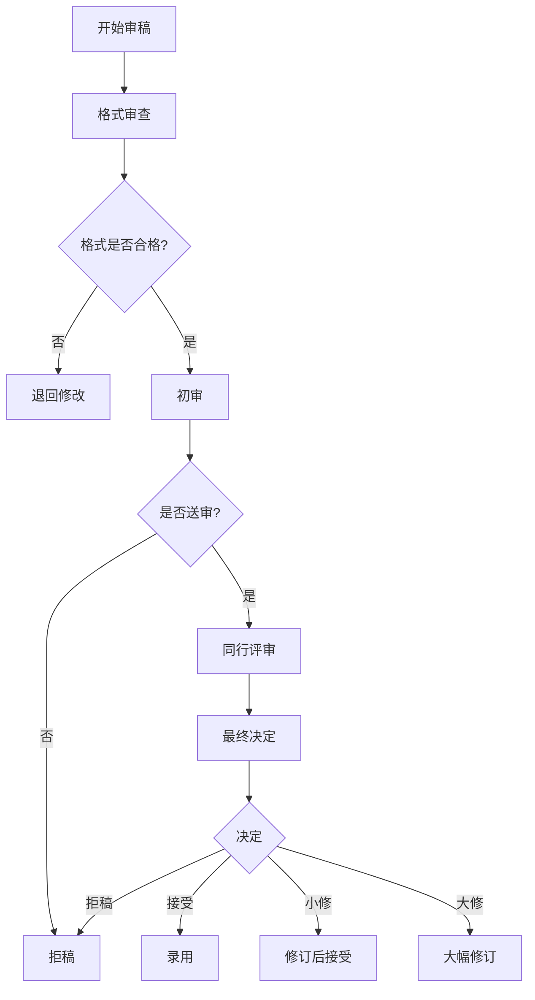

# Review Team Service - 审稿团队服务

## 概述

Review Team Service管理固定的审稿团队结构，实现标准的学术论文审稿流程。与Writing Team的动态结构不同，Review Team是固定的四角色结构，支持成员之间的非线性交互。

## 核心特性

- **固定团队结构**: 包含4个固定角色，不会动态增减
- **标准审稿流程**: 实现完整的学术审稿流程（格式审查→初审→同行评审→最终决定）
- **非线性交互**: 支持审稿团队成员之间相互讨论、协商和反馈
- **审稿报告管理**: 记录和管理所有审稿意见和决定
- **流程控制**: 自动推进审稿流程到下一阶段

## 审稿团队角色

### 1. Editorial Office (编辑部)
**职责**:
- 格式审查：检查文档格式规范性
- 组织送审：协调审稿流程
- 联络沟通：与作者和审稿人沟通

**对应需求**: 8.2

### 2. Editor in Chief (主编)
**职责**:
- 学术质量把控：评估研究质量和创新性
- 初审筛选：决定是否送审
- 流程监督：监督整个审稿流程
- 最终录用决定：做出最终的接受/拒稿决定

**对应需求**: 8.3

### 3. Deputy Editor (副主编)
**职责**:
- 协助质量把控：辅助主编评估学术质量
- 协助初审筛选：提供补充意见
- 分担工作负载：减轻主编工作压力

**对应需求**: 8.4

### 4. Peer Reviewer (审稿专家)
**职责**:
- 深入评估：对论文进行详细的学术评审
- 撰写审稿报告：提供详细的审稿意见
- 协助决策：为编辑决策提供专业建议

**对应需求**: 8.5

## 审稿流程



### 审稿阶段

1. **format_check**: Editorial Office执行格式审查
2. **initial_review**: Editor in Chief和Deputy Editor执行初审
3. **peer_review**: Peer Reviewer执行同行评审
4. **revision**: 作者修订（如需要）
5. **final_decision**: Editor in Chief做出最终决定
6. **completed**: 审稿流程完成

## 使用示例

### 初始化审稿团队

```typescript
import { createReviewTeam } from './services/reviewTeam';
import { createAgentManager } from './services/agentManager';
import { InteractionRouter } from './services/interactionRouter';

// 创建依赖服务
const agentManager = createAgentManager(systemConfig);
const interactionRouter = new InteractionRouter();

// 创建审稿团队
const reviewTeam = createReviewTeam(
  agentManager,
  interactionRouter,
  systemConfig
);

// 初始化团队（创建所有4个角色）
await reviewTeam.initialize();
```

### 开始审稿流程

```typescript
// 开始审稿
await reviewTeam.startReview(
  'paper-001',
  documentContent
);

// 获取流程状态
const state = reviewTeam.getWorkflowState();
console.log('当前阶段:', state.currentPhase);
console.log('审稿报告数:', state.reports.length);
```

### 提交审稿报告

```typescript
import type { ReviewReport } from './services/reviewTeam';

// Editorial Office提交格式审查报告
const formatReport: ReviewReport = {
  id: 'report-001',
  reviewer: 'editorial_office',
  reviewerId: 'editorial_office_123',
  phase: 'format_check',
  decision: 'accept',
  comments: '格式符合要求，可以送审。',
  issues: [],
  timestamp: new Date()
};

await reviewTeam.submitReport(formatReport);
```

### 非线性交互示例

```typescript
// Editor in Chief向Deputy Editor请求意见
const feedback = await interactionRouter.requestFeedback(
  'editor_in_chief_123',
  'deputy_editor_456',
  '关于这篇论文的创新性，你有什么看法？'
);

console.log('Deputy Editor的反馈:', feedback);

// Peer Reviewer向Editor in Chief请求澄清
await interactionRouter.sendMessage({
  id: 'msg-789',
  type: 'feedback_request',
  sender: 'peer_reviewer_789',
  receiver: 'editor_in_chief_123',
  content: '关于方法论部分，我需要更多背景信息才能评估。',
  metadata: {
    priority: 'medium',
    requiresResponse: true,
    timestamp: new Date().toISOString()
  },
  timestamp: new Date()
});
```

### 获取团队成员

```typescript
// 获取所有审稿团队成员
const members = reviewTeam.getTeamMembers();

members.forEach(member => {
  console.log(`${member.config.name} (${member.config.role})`);
  console.log(`状态: ${member.state.status}`);
  console.log(`当前任务: ${member.state.currentTask?.description}`);
});
```

### 销毁审稿团队

```typescript
// 审稿完成后销毁团队
await reviewTeam.destroy();
```

## 数据结构

### ReviewReport (审稿报告)

```typescript
interface ReviewReport {
  id: string;                    // 报告ID
  reviewer: AgentRole;           // 审稿人角色
  reviewerId: string;            // 审稿人ID
  phase: ReviewPhase;            // 审稿阶段
  decision: ReviewDecision;      // 审稿决定
  comments: string;              // 审稿意见
  issues: ReviewIssue[];         // 具体问题列表
  timestamp: Date;               // 创建时间
}
```

### ReviewIssue (审稿问题)

```typescript
interface ReviewIssue {
  type: 'format' | 'quality' | 'completeness' | 'coherence' | 'methodology' | 'citation';
  severity: 'minor' | 'major' | 'critical';
  description: string;
  affectedSection?: string;
  suggestion?: string;
}
```

### ReviewWorkflowState (审稿流程状态)

```typescript
interface ReviewWorkflowState {
  currentPhase: ReviewPhase;     // 当前阶段
  reports: ReviewReport[];       // 审稿报告列表
  finalDecision?: ReviewDecision; // 最终决定
  startTime: Date;               // 开始时间
  endTime?: Date;                // 结束时间
}
```

## 非线性交互支持

Review Team完全支持非线性交互，允许成员之间：

1. **相互讨论**: 成员可以主动发起讨论
2. **请求反馈**: 成员可以向其他成员请求意见
3. **协商决策**: 成员可以协商审稿决定
4. **澄清问题**: 成员可以请求澄清疑问

### 交互示例

```typescript
// 主编和副主编讨论论文质量
await interactionRouter.sendMessage({
  type: 'discussion',
  sender: 'editor_in_chief_123',
  receiver: 'deputy_editor_456',
  content: '这篇论文的方法论部分有些薄弱，你觉得呢？',
  // ...
});

// 审稿专家向编辑部请求作者信息
const authorInfo = await interactionRouter.requestFeedback(
  'peer_reviewer_789',
  'editorial_office_012',
  '能否提供作者的研究背景信息？'
);

// 副主编向主编提供补充意见
await interactionRouter.sendMessage({
  type: 'feedback_response',
  sender: 'deputy_editor_456',
  receiver: 'editor_in_chief_123',
  content: '我同意你的看法，建议要求作者补充实验细节。',
  // ...
});
```

## 与Writing Team的区别

| 特性 | Review Team | Writing Team |
|------|-------------|--------------|
| 结构 | 固定（4个角色） | 动态（1-N个角色） |
| 角色 | 预定义的审稿角色 | 根据任务动态创建 |
| 生命周期 | 整个审稿流程 | 写作任务完成后可销毁 |
| 交互模式 | 非线性交互 | 非线性交互 |
| 流程 | 标准审稿流程 | 灵活的写作流程 |

## 集成示例

### 与Core Engine集成

```typescript
class CoreEngine {
  private reviewTeam?: IReviewTeam;

  async startReviewProcess(documentId: string, content: string) {
    // 创建审稿团队
    this.reviewTeam = createReviewTeam(
      this.agentManager,
      this.interactionRouter,
      this.systemConfig
    );

    // 初始化团队
    await this.reviewTeam.initialize();

    // 开始审稿
    await this.reviewTeam.startReview(documentId, content);

    // 监听审稿进度
    this.monitorReviewProgress();
  }

  private monitorReviewProgress() {
    const checkProgress = setInterval(() => {
      const state = this.reviewTeam!.getWorkflowState();
      
      if (state.currentPhase === 'completed') {
        console.log('审稿完成');
        console.log('最终决定:', state.finalDecision);
        clearInterval(checkProgress);
      }
    }, 5000);
  }
}
```

## 错误处理

```typescript
try {
  await reviewTeam.initialize();
  await reviewTeam.startReview('paper-001', content);
} catch (error) {
  if (error.message.includes('未初始化')) {
    console.error('审稿团队未正确初始化');
  } else if (error.message.includes('AI服务配置未找到')) {
    console.error('AI服务配置错误');
  } else {
    console.error('审稿流程错误:', error);
  }
}
```

## 测试

```typescript
import { describe, it, expect, beforeEach } from 'vitest';
import { createReviewTeam } from './reviewTeam';

describe('ReviewTeam', () => {
  let reviewTeam: IReviewTeam;

  beforeEach(async () => {
    reviewTeam = createReviewTeam(
      mockAgentManager,
      mockInteractionRouter,
      mockSystemConfig
    );
    await reviewTeam.initialize();
  });

  it('应该创建4个固定角色', () => {
    const members = reviewTeam.getTeamMembers();
    expect(members).toHaveLength(4);
    
    const roles = members.map(m => m.config.role);
    expect(roles).toContain('editorial_office');
    expect(roles).toContain('editor_in_chief');
    expect(roles).toContain('deputy_editor');
    expect(roles).toContain('peer_reviewer');
  });

  it('应该正确推进审稿流程', async () => {
    await reviewTeam.startReview('paper-001', 'content');
    
    let state = reviewTeam.getWorkflowState();
    expect(state.currentPhase).toBe('format_check');
    
    // 提交格式审查报告
    await reviewTeam.submitReport(formatCheckReport);
    
    state = reviewTeam.getWorkflowState();
    expect(state.currentPhase).toBe('initial_review');
  });
});
```

## 相关文件

- `src/services/reviewTeam.ts` - Review Team实现
- `src/services/agentManager.ts` - Agent管理器
- `src/services/interactionRouter.ts` - 交互路由器
- `prompts/editorial_office.yaml` - 编辑部提示词
- `prompts/editor_in_chief.yaml` - 主编提示词
- `prompts/deputy_editor.yaml` - 副主编提示词
- `prompts/peer_reviewer.yaml` - 审稿专家提示词

## 需求映射

- **需求 8.1**: 固定的Review Team结构 ✓
- **需求 8.2**: Editorial Office职责 ✓
- **需求 8.3**: Editor in Chief职责 ✓
- **需求 8.4**: Deputy Editor职责 ✓
- **需求 8.5**: Peer Reviewer职责 ✓
- **需求 8.6**: 审稿团队非线性交互 ✓
- **需求 8.7**: 显示交互过程 ✓
- **需求 8.8**: 主动请求意见 ✓
